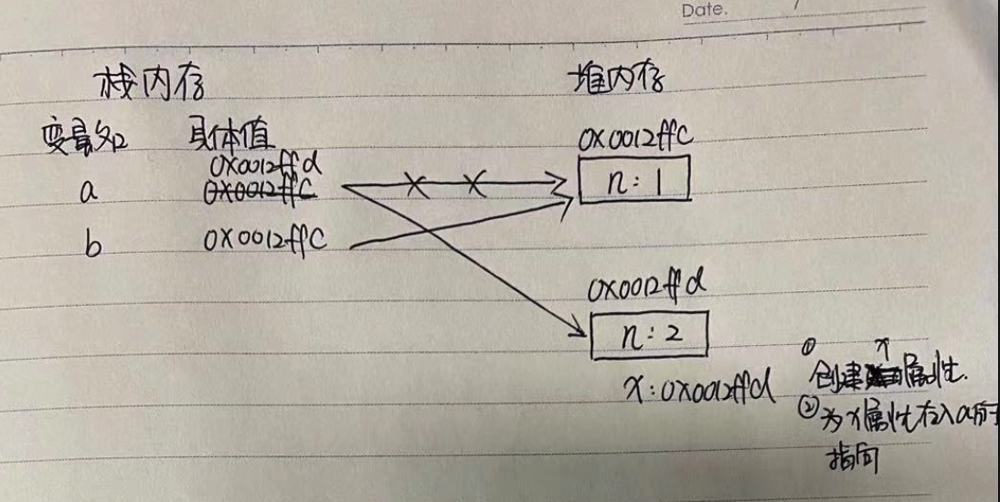
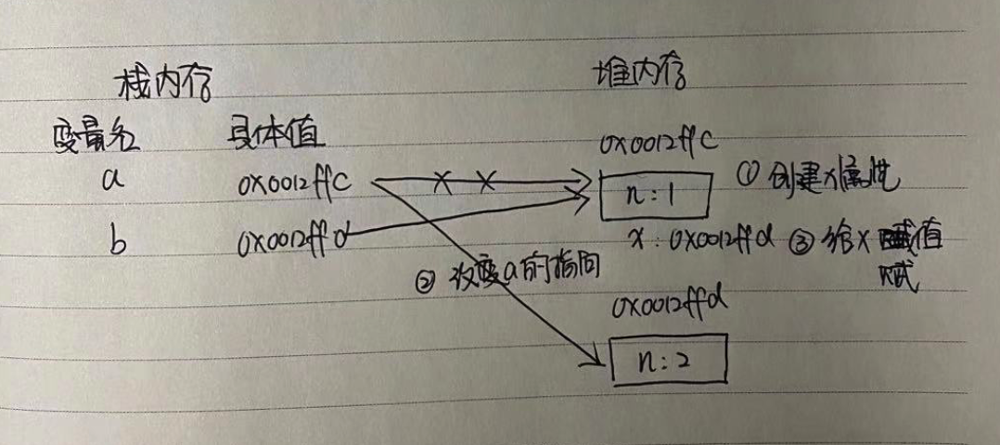

2020-11

## js经典面试题-连续赋值运算

今天看技术群里谈论连续赋值运算的问题，justjavac直接拿出了十年前的[文章](https://justjavac.com/javascript/2012/04/05/javascript-continuous-assignment-operator.html),10年前就有研究，在这里分享下我的理解：
#### 一. 两个顺序问题
1. js的代码（不考虑变量提升、异步操作），它的执行顺序是从上倒下，从左到右的，一行一行的执行的。
2. 赋值运算有以下两种形式：
简单的赋值运算=：把等号右侧操作数的值直接复制给左侧的操作数，因此左侧操作数的值会发生变化。
附加操作的赋值运算：赋值之前先对右侧操作数执行某种操作，然后把运算结果复制给左侧操作数。
注意，赋值运算是从右往左进行复制的
#### 二. JS内存的基础知识
JS的引用数据类型，比如数组Array，它们值的大小是不固定的。引用数据类型的值是保存在堆内存中的对象。JavaScript不允许直接访问堆	内存中的位置，因此我们不能直接操作对象的堆内存空间。在操作对象时，实际上是在操作对象的引用而不是实际的对象。因此，引用类型的值都是按引用访问的。这里的引用，我们可以粗浅地理解为保存在变量对象中的一个地址，该地址与堆内存的实际值相关联。
这里不做过多介绍，可以百度下堆栈的相关知识即可。

具备上述基础后，下面的题就很好理解了

#### 第一题：
```
var a = {n:1}; 
var b = a;  
a = {n:2}; 
a.x = a;
console.log(1,a); // { n: 2, x:{ n: 2, x:{ n: 2,x:{...循环 } } } }
console.log(2,a.x); // { n: 2, x:{ n: 2, x:{ n: 2,x:{...循环 } } } }
console.log(3,b); // {n: 1}
console.log(4,b.x); // undefined
```

##### 分析：
```
var a = {n:1};  // 开辟一块内存空间a，在栈内存中存入{n:1}的指针0x0012ffc
var b = a;   //  开辟一块内存空间b，在栈内存中存入{n:1}的指针0x0012ffc
a = {n:2};  // 更改a的指向为0x0012ffd
a.x = a; // 创建x属性，并将x属性存入a的指针0x0012ffd
因此b一直指向指针0x0012ffc的地址，所以打印的结果很好理解。
a有x属性，x属性指向a，一直循环。因此console.log(1,a);console.log(2,a.x);打印出来是循环引用的样子。
```


#### 第二题：
```
var a ={n:1};
var b = a;
a.x=a={n:2};
console.log(1,a); // {n: 2}
console.log(2,a.x); // undefined
console.log(3,b); // {n: 1, x: { n: 2 }}
console.log(4,b.x); // {n: 2}
```
##### 分析：
```
var a = {n:1};  // 开辟一块内存空间a，在栈内存中存入{n:1}的指针0x0012ffc
var b = a;   //  开辟一块内存空间b，在栈内存中存入{n:1}的指针0x0012ffc
a.x=a={n:2}; // 1. 创建a的属性；2.更改a的指向为0x0012ffd；3. 给x赋值{n:2}的指针0x0012ffd
这里需要注意顺序问题先1. 创建a的属，在从右向左进行赋值运算。
console.log(1, a); // 打印时候先找a的指针，指向为0x0012ffd {n:2},因此打印为{n:2}。
console.log(2, a.x); // 打印时候先找a的指针，指向为0x0012ffd {n:2},不包含a的属性，因此打印为undefined。
console.log(3,b); // 打印时候先找b的指针，指向为0x0012ffc,如下图，因此打印为{n: 1, x: { n: 2 }}
```
